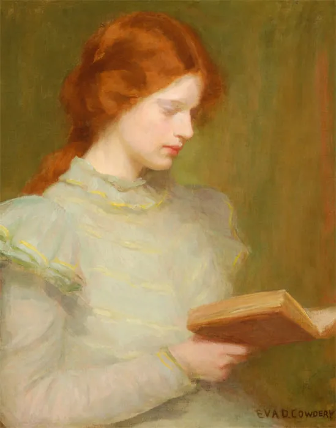

---
hide:
  - toc
  - title

---

# 

This musical game aims to emulate the tropes of European fantastic literature of the 19th century through the unfolding of a series of predefined storylines, determined by the audience. Each scene is accompanied by songs belonging to a musical corpus designed in advance by the performers. 

In _A Gothic Gamebook_ we have selected songs from the German musical tradition of the Romanticism, with compositions by authors such as Johannes Brahms, Robert and Clara Schumann, Hugo Wolf, Franz Schubert and Johanna Kinkel.

Contrary to the fantastic literature and gamebook genres, where the story is usually told from the perspective of a single main character, we have introduced the possibility for the audience to switch the narrative between two characters. By turning the spotlight on a different character, the audience takes a more directive stance rather than a first-person immersive one. Furthermore, the ability to jump from a storyline to another enriches the complexity of the story graph, incresing significantly the space of possibilities while keeping the number of scenes reasonably small.

This musical game aims to brigde the divide between audience and performers, providing a space for co-creation and distributed authorship for canonical Western classical music repertoire.

