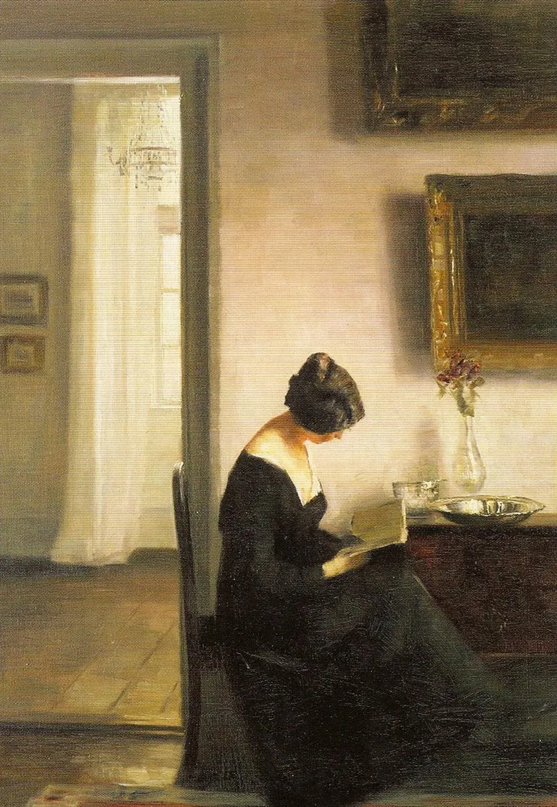

---
hide:
  - toc
  - title

---

# 

## Storypath example

During the music festival of [Oddities & Rarities](https://orpheusinstituut.be/nl/nieuws-en-events/oddities-rarities) (website in Dutch), a première of _A Gothic Gamebook_ has been performed on 30 November 2025 at Orpheus Instituut Ghent.

Four singers and two pianists have shared a corpus of more than 30 German _lied_ scattered into 28 scenes of the musical gamebook.

We have explicitly chosed for gender-neutral names for the main characters, respectively Sasha and Rune, and secondary characters, the witch Ymir and the hermit Vanadis.

### Data and statistics

According to our [statistics](https://github.com/NicholasCorniaOrpheus/a_gothic_gamebook/blob/main/data/agg_statistics.json), available with corresponding [simulation code](https://github.com/NicholasCorniaOrpheus/a_gothic_gamebook/blob/main/modules/analysis.py) in our [GitHub repository](https://github.com/NicholasCorniaOrpheus/a_gothic_gamebook/tree/main), there are 294 possible storypaths given the designed musical gamebook structure available [here](https://github.com/NicholasCorniaOrpheus/a_gothic_gamebook/blob/main/data/agg_dict.json). Furthermore, our average storypath is 10 scenes long with an average duration of  about 1 hour for the performance.

The fields `goes_to` and `comes_from` provide the hierarchical information for each scene in the graph, while `change_spotlight` regulates the possibility for the audience to suddenly turn the attention to the other protagonist.

Music is recorded in a [CSV](https://github.com/NicholasCorniaOrpheus/a_gothic_gamebook/blob/main/data/agg_music.csv) tabular structure with metadata, such as composer and title, and timing in minutes. In a similar fashion is possible to provide a [list of scenes](https://github.com/NicholasCorniaOrpheus/a_gothic_gamebook/blob/main/data/agg_scenes.csv) via tabular data.

### Narrative structure

#### Introduction

_Two young lovers, Sasha and Rune, are in extreme distress. The greedy tutor of Rune has decided to marry them to an old, rich bachelor without their consent.On the day of the arranged marriage, the two have planned to meet at an old milestone near an abandoned castle and escape together. Rune escapes from captivity and is seeking shelter in the abandoned estate, while Sasha has to cross the great forest by night in order to reunite with their beloved._

#### Act I

Our protagonists encounter a series of challenges, both natural and supernatural, during the long night following their escape. Finally, tired and proved by many sleepless hours, they embrace the realm of dreams.

#### Act II

Sasha is confronted with the primorial and misterious sorcery of the witch Ymir, while Rune finds shelter and support in the abandoned chapel of the lonely hermit Vanadis.

#### Act III

The events of the last hours have challenged both body and spirit of our protagonists. Shall their love overcome their vicissitudes, or will they be parted forever? 

### Graphical representation storypath

<iframe src="https://nicholascorniaorpheus.github.io/a_gothic_gamebook/assets/storypath/agg_2025_storypath.html" height="30%" width="100%" title="A Gothic Gamebook Storypaths"></iframe>

